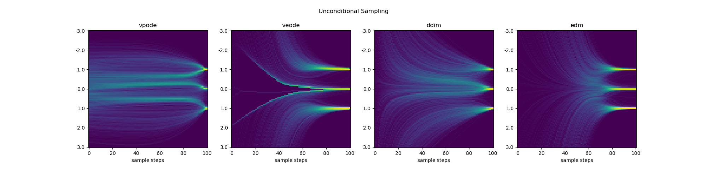
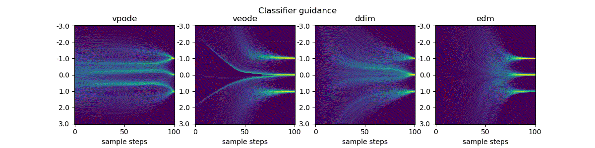
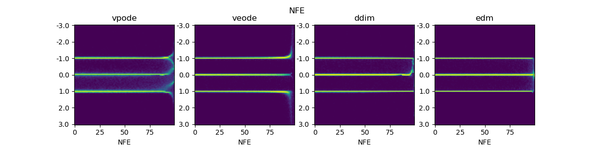

# Diffusion Models Minimal Tutorial

This repository contains code implementations related to the blog post [Zhihu](https://zhuanlan.zhihu.com/p/682151286). The tutorial provides a minimalistic introduction to diffusion models along with a toy example code implementation. 

The main task of the code is to learn a simple probability distribution containing three numbers {-1, 0, 1} with uniform probability. The repository includes implementations of four diffusion ODEs: vp-ode, ve-ode, ddim, and edm.

## Code Usage Instructions
train all odes
```
python toy_example.py --ode all --phase train --device [YOUR_DEVICE]
```
eval
```
python toy_example.py --phase eval --device [YOUR_DEVICE]
```

## Visualization Showcase
Unconditional sampling



Classifier-guidance sampling with increasing guidance strength 



Classifier-free-guidance sampling with increasing guidance strength 


NFE


